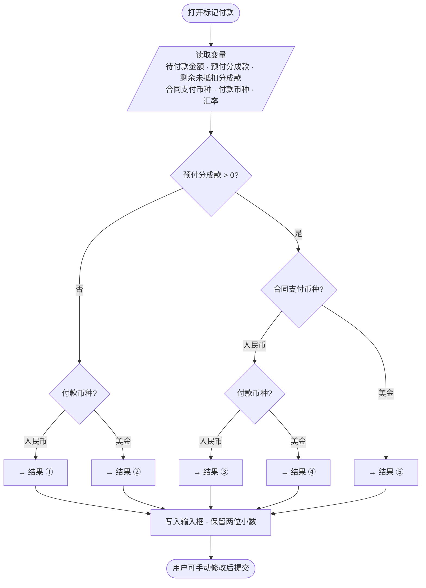

# 代理游戏台账 — UI 规范

> 原型路径：`src/prototypes/agent-game-finance/`  
> 预览：`/prototypes/agent-game-finance`  
> 最后更新：2026-07-20（Batch 7 批注验收；收入汇总导出；申请/标记付款行为对齐）

本文档汇总「代理游戏台账」原型的 UI/交互规范，供后续对话、改页、加功能时统一引用。

---

## 1. 色彩

| 用途 | 值 | CSS 变量 |
|------|-----|----------|
| 主题主色 | `#4165d7` | `--color-primary` |
| 主色悬停 | `#5474db` | `--color-primary-hover` |
| 正文 | `#333333` | `--color-text` |
| 次要文字 | `#666666` | `--color-text-secondary` |
| 弱化文字 | `#999999` | `--color-text-muted` |
| 边框 | `#E8E8E8` | `--color-border` |
| 表头背景 | `#FAFAFA` | `--color-table-head` |
| 页面背景 | `#F0F2F5` | `--color-page-bg` |

**状态标签（StatusBadge）**

| 状态 | 样式 |
|------|------|
| 已上线、合作中、已申请、已付款 | success 绿 |
| 未付款、未申请 | warning 橙 |
| 合作终止 | danger 红 |
| 未上线 | muted 灰 |

---

## 2. 按钮

### 列表上方主按钮（Primary）

- 背景/边框：`#4165d7`，悬停 `#5474db`
- 文字：白色，14px
- 高度：32px，圆角 4px，padding `0 15px`
- class：`agf-btn agf-btn--primary`

### 次要按钮

- 白底 + 灰边框，悬停边框/文字变主色
- class：`agf-btn agf-btn--default`

### 表格内链接操作

- 无背景，主色文字
- class：`agf-btn agf-btn--link`

### 主按钮禁用态（`:disabled`）

| 项 | 值 |
|----|-----|
| 背景 | `#F5F5F5` |
| 边框 | `#E8E8E8` |
| 文字 | `#BFBFBF` |
| 鼠标 | `not-allowed` |
| 适用 | `agf-btn--primary`、`agf-btn--default` |

---

## 3. 列表查询栏

### 业务类型选择（BusinessTypeSelect）

所有带 `FilterBar` 的列表页，查询栏**最左侧**固定展示业务类型下拉，作为**数据权限/数据范围**切换。

| 项 | 规范 |
|----|------|
| 组件 | `components/BusinessTypeSelect.tsx`（内置于 `FilterBar.tsx`） |
| 选项 | **游戏盒** / **快爆**（内部值 `4399` / `快爆`） |
| 默认 | **游戏盒**（`4399`） |
| 样式 | `agf-select agf-business-type-select`；宽度 **100px** |
| Store | `businessType` + `setBusinessType`；列表用 `scopedVendors` / `scopedGames` / `scopedSettlements` / `scopedPayments` / `scopedBalances` |
| 数据隔离 | 两套 mock **完全独立**；切换业务仅显示对应 `Vendor.businessType` 数据 |
| ID 段 | 4399：厂商 **1001+**、游戏 **4001+**；快爆：厂商 **2001+**、游戏 **5001+** |
| 新增 | `addVendor` / `addGame` 写入当前 `businessType`，ID 在对应段递增 |
| 结算按钮 | `internalSettlementButtons` / `externalSettlementButtons` **按 `businessType` 分桶** |

工具：`utils/businessScope.ts`

### 三栏独立查询（ListSearchFields）

按列表实际字段显示，多框为 **且** 关系：

| 输入框 placeholder | 匹配规则 |
|-------------------|----------|
| 游戏ID / 游戏名称 | 游戏 ID 或**游戏名称**（`onlineName`，上线后正式名称） |
| 合同游戏名称 | 仅**合同游戏名称**（合同内定义名）；仅游戏管理开启 |
| 厂商ID | 仅厂商 ID |
| 厂商名称 | 仅厂商名称 |

**各页模式**

| 模式 | 页面 |
|------|------|
| `gameAndVendor` + `showContractName` | **游戏管理** |
| `gameAndVendor` | 结算公式、**收入汇总统计**、**外部/内部/退款结算** |
| `vendor` | 厂商管理（**厂商收入**、**厂商付款管理** 侧栏已隐藏，路由仍保留） |

**结算页时间查询**：外部收入结算、内部收入结算、内部退款结算顶部查询栏使用 `MonthRangePicker`；默认 `getRecentTwoMonthsRange()`（**近两个月** = 上个月 + 当前月）；**【数据拉取】成功后时间保持近两个月，不切换为单月**（范围存 `internalSettlementButtons[type].monthRange`）；表头「收入时间 / 退款时间」列仅展示，不用 `ColumnFilter`。

> **Mock 说明**：初始结算数据 `incomeTime` 覆盖 **2026-06 / 2026-07**；与结算三页、收入汇总默认时间范围一致，打开即可见样例。

组件：`components/ListSearchFields.tsx`  
逻辑：`utils/listKeyword.ts` → `matchesListSearch`

### 查询栏布局（FilterBar）

| 项 | 规范 |
|----|------|
| 结构 | 两行：`agf-list-toolbar__row`（业务类型 + 查询框 + 可选 `aside`）+ `agf-list-toolbar__actions`（次要操作） |
| 第一行 | 最左 `BusinessTypeSelect`；中间 `ListSearchFields` 等；可选 `aside` 放右对齐工具按钮；**或**在查询字段末尾 **inline** 放置【导出】等 primary 按钮 |
| 第二行 | `FilterBar.actions` 插槽；如游戏管理【添加游戏】 |
| 样式 | `style.css` → `.agf-list-toolbar__row` / `__aside` |

**游戏管理示例**：第一行 = 业务类型 + 游戏ID/名称 + 合同游戏名称 + 厂商ID + 厂商名称 + 【导出】（inline）；第二行 = 【添加游戏】。

**收入汇总统计示例**：第一行 = 业务类型 + 查询维度 + 时间 + 游戏/厂商搜索 + 【导出】（inline，在「厂商名称」右侧）；**不用** `aside` 右对齐。

### 月份范围查询（MonthRangePicker）

用于**数据统计**各页顶部时间筛选；最小维度为**月**。

| 项 | 规范 |
|----|------|
| 组件 | `components/MonthRangePicker.tsx` |
| 工具 | `utils/monthRange.ts`（`getRecentTwoMonthsRange`、`getSampleMonthRange`、`getDefaultMonthRange`、`isMonthInRange`） |
| 展示格式 | `YYYY-MM - YYYY-MM`（如 `2025-05 - 2025-06`） |
| 输入框 | 左侧日历图标；`min-width: 228px`；高度 32px；padding `0 12px` |
| 展开态边框 | `border: 1px solid #4165d7`（class `agf-month-range__input--open`） |
| 下拉面板 | 双年并排；年间 `1px #e4e7ed` 竖线；选中月份蓝底圆点 + 区间浅蓝 `#eef2fc` |
| 未来月份 | 置灰不可选 |
| 默认范围（数据统计） | `getSampleMonthRange()` → `2026-06 - 2026-07`（对齐 mock） |
| 默认范围（结算三页） | `getRecentTwoMonthsRange()` → 近两个月（如当前 2026-07 则为 `2026-06 - 2026-07`） |
| 表头「时间」列 | **仅展示**，不用 `ColumnFilter` 筛选 |

交互：第一次点选起始月，第二次点选结束月后关闭并生效；同月则起止相同。

### 侧栏导航（`index.tsx` + `Sidebar.tsx`）

| 分组 | 可见菜单 |
|------|----------|
| **游戏支付管理** | 厂商管理、游戏管理 |
| **财务分成管理** | 结算公式管理、外部/内部/退款结算、**游戏收入管理**、**游戏付款管理** |
| 数据统计 | **仅**「收入汇总统计」（`stats-summary`） |

- 平台名称（侧栏 Logo、面包屑）：**代理游戏台账**。
- **侧栏隐藏页**（`vendor-income` 厂商收入、`payment-list` 厂商付款管理）：不在 `MENU_GROUPS` 展示，但已注册于 `defineHashPageRoute`，深链 `#page=vendor-income` / `#page=payment-list` 可访问。

---

## 4. 表格

### 列表区布局

| 项 | 规范 |
|----|------|
| 左右留白 | `.agf-card` 设 `--agf-gutter: 24px`；查询栏（`agf-list-toolbar`）、表格区、分页左对齐 |
| 结构 | `agf-table-panel`（外边距）→ `agf-table-wrap`（边框容器）→ `agf-table` |
| 外边框 | `agf-table-wrap`：`border: 1px solid #E8E8E8`（`--color-border`）、`border-radius: 4px`、白底 |
| 分页位置 | 在表格外框**下方**，无上边框；`.agf-pagination` 底内边距 `16px`；`.agf-table-panel` 底外边距 `24px` |
| 末行 | `tbody tr:last-child td` 无底边框，避免与外框双线 |

**抽屉 / 弹窗内列表**：同样用 `agf-table-wrap` 包裹 `agf-table`（操作记录、导入预览等）；无 `agf-table-panel` 外边距（抽屉 body 自有 padding）。弹窗内表格与上方内容间距可用 `agf-table-wrap--spaced`（`margin-top: 16px`）。

组件：`components/DataTable.tsx`（主列表）；样式：`style.css`

### 列布局约定

- 表头字段：**加粗**（`font-weight: 700`）
- 游戏 ID + 名称：可用 `DualCell`，单行展示为 `ID / 名称`（如 `4001 / 星际探险OL`）；名称取 `onlineName`（游戏管理「游戏名称」字段）；表头文案斜杠前后加空格（如 `游戏ID / 游戏名称`）
- 厂商 ID、厂商名称：**分两列**，不合并
- 枚举列：表头带漏斗筛选（`ColumnFilter` + `utils/columnFilters.ts`）
- **列头筛选下拉**：选项文字 `font-weight: 400`，不继承表头 `700` 加粗（`.agf-col-filter__menu` / `__item`）；菜单通过 Portal 挂到 `body`，`position: fixed` + `z-index: 10000`，列表高度不足时不被表格容器裁切
- **列头排序**：`ColumnSort.tsx`；点击切换升/降序；用于游戏管理三项已付金额列

### 主列表金额展示

| 工具 | 说明 |
|------|------|
| `formatMoney(value)` | 千分位 + 两位小数（`zh-CN` locale），**不含**币种符号 |
| `formatCurrencyMoney(value, currency)` | `currencySymbol` + `formatMoney`；如 `￥320,000.00`、`$390,000.00` |
| `currencySymbol` | 人民币 → **￥**；美金 → **$** |
| `SETTLEMENT_CURRENCY` | 固定 `'人民币'`（**￥**） |

**展示组件**（`components/DataTable.tsx`）

| 组件 | 用途 |
|------|------|
| `CurrencyAmount` | 单行「符号 + 千分位数字」；符号与数字间距 **4px** |
| `CurrencyStackCell` | 多币种上下堆叠；每行独立 `CurrencyAmount`，纵向 `flex-end` 贴右 |
| `renderCurrencyTotals(totals)` | 查询总计行多币种求和展示；人民币在上、美金在下 |

**对齐**：所有列表金额列（含表头）设置 `Column.align: 'right'`（`COL_ALIGN_RIGHT`）；单元格 class `agf-table__cell--right`；等宽数字 `tabular-nums`。多币种堆叠（`CurrencyStackCell`）在右对齐单元格内贴右展示。

**币种规则**

| 页面/列 | 币种 |
|---------|------|
| 外部/内部/内部退款结算（待结算金额、结算收入等） | 固定 **￥** |
| 收入汇总 — 支付金额 | 各游戏 `Contract.currency`（合同管理中维护）；多币种行用 `CurrencyStackCell` |
| 收入汇总 — 总收入 / 结算付款金额 | 固定 **￥**（结算口径） |
| 游戏管理 — 三项已付 | 各游戏 `Contract.currency`（合同管理中维护） |
| 厂商收入、游戏收入管理 — 账户总收入/余额/累计收入/退款 | 固定 **￥**（来自内外部结算，人民币口径） |
| 厂商收入、游戏收入管理 — 预付分成款/已抵扣/剩余 | `prepaymentCurrency`（预付首次保存快照）；未填 `-`；未保存前输入前缀取 `Contract.currency`；未设置时前缀为空 |
| 厂商付款管理、游戏付款管理 — 待付款/实际付款金额 | 固定 **￥**（来自账户余额申请，人民币口径） |
| 厂商/游戏付款 — 【标记付款】实际付款美金 | **$**（`CurrencyInput` / 只读展示）；选填；未填不保存 / 详细信息显示 `-` |

**支付币种（2026-07-20）**

| 项 | 规则 |
|----|------|
| `Contract.currency` | **合同管理**抽屉维护（单选：人民币 / 美金）；保存必填；各模块金额前缀与列表展示均读此字段 |
| `Vendor.prepaymentCurrency` / `Game.prepaymentCurrency` | 【付款设置】**首次保存**预付时写入当时 `Contract.currency`；后续编辑预付金额不改 |
| 未设置币种 | `CurrencyInput` / 只读金额**不显示** ￥/$ 前缀 |
| 工具 | `utils/currencySnapshot.ts` → `resolveContractCurrency` / `resolvePrepaymentCurrency` / `withCurrencyOnFirstSave` |

实现：`utils/settlement.ts`；结算收入列可用 `formatSettlementIncome`（内部已带 ￥）。

### 查询总计行（leadingRow / trailingRow）

列表在表体展示「查询总计」汇总行；**不参与分页**；空列表时不显示。

| 项 | 规范 |
|----|------|
| API | `DataTable` 传 `leadingRow`（首行）或 `trailingRow`（末行） |
| 位置 | **收入汇总统计**：表体**第一行**（`leadingRow`）；**游戏管理**：表体**最后一行**（`trailingRow`） |
| 标签 | 首列固定 **查询总计**（游戏管理为「付款方」列） |
| 中间列 | 非汇总列留空 |
| 多币种金额 | 当前筛选结果按币种分别求和；`renderCurrencyTotals` + `CurrencyStackCell` |
| 单币种金额 | 当前筛选结果数值列求和；**￥** + 千分位 |
| 样式 | `agf-table__summary-row`；白底、常规字重；无 hover 灰底 |

### 分页（Pagination + DataTable）

**所有使用 DataTable 的列表均启用分页**；**无数据时也显示分页**（「共 0 条」+ 每页条数 + 页码，页码固定为 1）。

**空状态**（`DataTable` → `TableEmptyState`）：

| 项 | 规范 |
|----|------|
| 表头 | **保留**，不因无数据隐藏 |
| 表体 | 居中展示空盒插画（`agf-table-empty__icon`，浅蓝 `#EEF2FC`）+ 文案「暂无数据」（`agf-table-empty__text`，14px 弱化色） |
| 区域高度 | `min-height: 220px`；上下 padding `48px` |
| 分页 | 表格外框**下方**仍显示「共 0 条」+ 条数下拉 + 页码 1 |
| 自定义文案 | 可选 prop `emptyText`（默认「暂无数据」） |

| 项 | 规范 |
|----|------|
| 默认每页 | 20 条 |
| 可选 | 10 / 20 / 30 / 50 / 100 / 200 |
| 布局 | 整体居中：「共 X 条」+ 条数下拉 + 页码导航 |
| 筛选后 | 自动回到第 1 页 |

**当前页按钮（选中态）**

- 背景：`#eef2fc`（浅蓝，非实心主色）
- 边框/文字：`#4165d7`
- 字重：500

**页码规则**

- 总页 ≤7：全部显示
- 否则：1…6…末页 或 1…当前±1…末页

组件：`components/Pagination.tsx`，内置于 `components/DataTable.tsx`

---

## 5. 抽屉（Drawer）

### 宽度

| 类型 | 宽度 | 场景 |
|------|------|------|
| 标准抽屉 | **730px** | 添加/编辑游戏、合同管理、结算公式、**付款设置**、标记付款、详细信息等（默认或 `large`） |
| 宽抽屉 | **1175px** | 厂商管理添加/编辑（`width={1175}`）、**结算函**（`SettlementLetterDrawer`） |

### 730px 抽屉 — 横向表单

```
[标签 168px 右对齐]：[控件区 flex:1]
```

| 规则 | 说明 |
|------|------|
| 标签宽度 | 168px，`text-align: right` |
| 标签后缀 | CSS 自动追加 `：`（`::after`） |
| 标签 | `white-space: nowrap`，14px，`#333` |
| 控件/只读值 | 14px，`#333` |
| 表单项间距 | 20px |

### 只读字段（ReadonlyField）

- **纯文本**，无输入框边框/背景
- 参考：编辑广告位抽屉中的不可编辑行
- 组件：`components/FormFields.tsx` → `ReadonlyField`

### 抽屉内信息行（非表单布局）

- 用于操作记录等「表格上方说明当前对象」的场景
- class：`agf-drawer-meta`
- 左对齐与下方表格首列文字齐平（`padding-left: 16px`，匹配 `th/td` 水平 padding）
- **不要**使用 168px 右对齐 `ReadonlyField` 表单布局

### 单选字段（Radio）

- 16px 圆形，选中：蓝色描边 + 蓝色实心圆点
- 未选中：灰色描边空心
- 选项横向排列，间距 24px，与标签垂直居中
- class：`agf-radio-group` / `agf-radio-item`

### 字段说明（FieldHint）

- 用于必填/重要输入框下方补充释义（如游戏添加/编辑的两个名称字段）
- 组件：`FormFields.tsx` → `FieldHint`；class：`agf-form-hint`
- 样式：12px，`--color-text-muted`，距输入框上缘 6px；**红色校验文案（`FieldError`）位于灰色说明下方**
- 游戏名称：「游戏上线后所使用的正式名称」
- 合同游戏名称：「签约合同所使用的游戏名称」

### 复合型金额输入（CurrencyInput）

- 用于合同金额、已付*金额等带币种前缀的数字输入
- 组件：`FormFields.tsx` → `CurrencyInput`
- 结构：`agf-input-affix--prefix` + `agf-input-affix__prefix`（背景 **`#f5f7fa`**，显示 **￥** 或 **$**；**未设置币种时不渲染前缀**）+ 右侧数字输入
- 前缀来源：取 `Contract.currency`（合同管理维护）；**未设置时前缀为空**
- **合同金额初始**：未填写时不显示 `0.00`（`Contract.contractAmount?`；`contractAmountToField`）
- 规则：≥0，精确至小数点后两位；聚焦时外框主题色 `#4165d7`

### 复合型百分数输入（PercentAffixInput / PercentInput / DecimalPercentInput）

- 用于结算公式设置：渠道费、分成、扣税点手输
- 组件：`FormFields.tsx`
- 结构：`agf-input-affix` + 右侧 `agf-input-affix__suffix`（背景 **`#f5f7fa`**，显示 **%**）+ 左侧数字输入（**不用** `type="number"` 步进器）
- **PercentInput**：渠道费/分成；0–100 **整数**；下方灰字「请输入0-100的整数」；存储为小数
- **DecimalPercentInput**：扣税点自定义/发票「其他」；0–100 百分数，最多两位小数；存储为小数（如界面 `6` → `0.06`）
- 抽屉内 `.agf-form-field > .agf-form-input` 全宽规则**不作用于** `.agf-input-affix` 内 input（避免 `%` 被裁切）

### 合作内容多选（Checkbox Group）

- 用于合同管理「合作内容」等横向多选
- class：`agf-checkbox-group` / `agf-checkbox-item`（`style.css`）
- 至少勾选一项；取消勾选时隐藏对应条件字段并清空输入

### 多行文本（备注等）

- 聚焦边框：主题蓝 `#4165d7`，无浏览器默认 outline
- class：`agf-form-textarea`

### 必填与提交校验

- 标签前红色 `*`
- class：`agf-form-label--required`（宽表格用 `agf-form-grid__label--required`）
- **提交校验**：任一必填未填时
  1. 字段下方先展示灰色说明（`FieldHint` / `agf-form-hint`，如有）
  2. 其下展示小号红字：`{字段名}不能为空`（`agf-form-error` / `agf-form-grid__error`，12px，`#F56C6C`）
  3. 顶部红色 Toast：`请完善所有信息`，显示 **3 秒**后隐藏（`Toast type="error"`）
  4. 不关闭抽屉、不提交
  5. 用户修改该字段时清除对应错误（`clearError`）

### Toast（`Modal.tsx` → `Toast`）

**全站统一**：成功用绿色、失败用红色；**不再使用**深色默认 Toast。`type` 必填：`ToastType = 'error' | 'success'`。

| 类型 | 场景 | 样式 |
|------|------|------|
| `success` | 结算成功、导入成功、拉取成功、标记付款等 | 浅绿底 `#F0F9EB`、绿字 `#67C23A`、边框 `#E1F3D8`、左侧绿勾图标 |
| `error` | 校验失败、无数据、余额不足等 | 浅红底 `#FEF0F0`、红字 `#F56C6C`、边框 `#FDE2E2`、左侧红叉图标 |

| 项 | 值 |
|----|-----|
| 时长 | 3000ms |
| class | `agf-toast` + `agf-toast--success` / `agf-toast--error` |

表单校验失败仍用 `type="error"`，文案「请完善所有信息」。

### 模拟文件上传（`MockFileUpload`）

用于**厂商/游戏付款管理**【请款凭证】场景。

| 项 | 规范 |
|----|------|
| 组件 | `components/MockFileUpload.tsx` |
| 交互 | 【选择文件】主题蓝按钮；选后下方列表展示文件名（蓝色可点击 **浏览器下载**） |
| 格式说明 | 可选 `hint` 属性；按钮下方灰色文案：**支持的上传格式为：png、jpg、pdf** |
| 接受类型 | `accept=".pdf,.jpg,.jpeg,.png"` |
| 列表 | 文件图标 + 文件名 + 绿色成功勾 + **× 删除**（`agf-file-upload__remove`；hover 红 `#F56C6C`）；**无**灰色虚线分隔 |
| 删除 | 点击 × 从列表移除；提交保存时同步（删光后字段清空） |
| 存储 | 提交时将文件名写入 `PaymentRequest.settlementLetter` / `invoice` 或 `GamePaymentRequest` 对应字段（逗号分隔） |

### 顶部面包屑 — 页面说明入口

| 项 | 规范 |
|----|------|
| 位置 | `AdminLayout` 面包屑最后一项（当前页标题）**右侧** |
| 组件 | `components/VendorIncomeFieldHelp.tsx`（通过 `breadcrumbExtra` 注入，仅 `vendor-income` 页） |
| 图标 | `CircleHelp`，class `agf-help-btn`；灰色，hover 主色 |
| 弹窗 | Modal 标题「厂商收入字段说明」；**`plain`**（标题区无下分割线）；**无 footer**（无「知道了」按钮） |
| 关闭 | 右上角 ×、点击遮罩、Esc |
| 正文 | `agf-field-help-list` 无序列表，4 条字段口径说明 |

### Modal 尺寸与样式

| 项 | 规范 |
|----|------|
| 组件 | `components/Modal.tsx` |
| 默认宽度 | `max-width: 560px` |
| 大号 | `large` → `agf-modal--lg`（720px） |
| 超大 | `xl` → `agf-modal--xl`（960px） |
| 紧凑 | `compact` → `agf-modal--compact`（`width: auto; min-width: 420px; max-width: 480px`） |
| 无分割线 | `plain` → 标题区/底栏无上下灰线 |

---

## 6. 业务枚举

| 字段 | 可选值 |
|------|--------|
| 运营状态 | 已上线 / 未上线 |
| 合作状态 | 合作中 / 合作终止 |
| 版号 | 有 / 无 |
| 申请付款状态（结算三页） | 未申请 / 已申请 |

### 结算公式列展示（结算三页 + 导入弹窗）

- 工具：`utils/settlement.ts` → `displaySettlementFormula(text)`、`formatFormulaText`
- **去掉前缀**：`外部：`、`外部渠道：`、`内部：`、`内部渠道：`、`退款：`
- **表达式格式**：`待结算金额*（1-{渠道费}-{税率}）*{分成}`
- 展示示例：`待结算金额*（1-0%-0%）*45%`
- **结算公式管理列表**仍保留「内部渠道：/外部渠道：」两行完整文案（不在此去前缀规则内）
- 未结算展示：`formatSettlementIncome` / `formatSettlementTime` → `-`

### 样例默认渠道费

| 渠道类型 | 渠道费 |
|----------|--------|
| 外部渠道 | **0%** |
| 内部渠道 | **5%** |

来源：`mock-data.ts` → `makeFormula`；样例结算 S001–S021 金额已对齐。

### 游戏名称字段约定

| 界面标签 | 数据字段 | 含义 | 示例（4001） |
|----------|---------|------|-------------|
| 游戏名称 | `onlineName` | 上线后正式名称 | 星际探险OL |
| 合同游戏名称 | `name` | 签约合同用名 | 星际探险 |

| 展示场景 | 取值 |
|----------|------|
| 「游戏ID / 游戏名称」列、抽屉只读、`agf-drawer-meta`、搜索「游戏ID / 游戏名称」 | `onlineName`（`store.getGameName(id)`） |
| 「合同游戏名称」列、搜索「合同游戏名称」 | `name` |

---

## 7. 页面字段清单

### 游戏管理 — 列表

| 列 | 说明 |
|----|------|
| **付款方** | 表头筛选（4399、纯游、游乐、游戏之家、香港4399、游家时代）；无值列表显示 `-` |
| 游戏ID / 游戏名称 | `DualCell`，`onlineName` |
| 合同游戏名称 | `name` |
| 厂商ID、厂商名称 | 分两列 |
| **已付游戏代理金** / **已付预付分成款** / **已付委托开发费** | 表头**排序**；有值 `formatCurrencyMoney`（厂商币种 + 千分位）；无值 `-` |
| 运营状态 | 表头筛选 |
| 操作 | 编辑、合同管理、**支持渠道**、操作记录 |

**默认排序**：按 `Game.createdAt` **添加时间新→旧**；点击已付列后按该列金额升/降序。

**查询总计行**：表体**最后一行**「查询总计」（首列「付款方」）；三项已付金额按币种分别求和（`renderCurrencyTotals`）；中间列留空；`DataTable.trailingRow`；不参与分页；空列表不显示。

**导出**：查询栏第一行，「厂商名称」输入框**右侧**【导出】（`agf-btn--primary`）；第二行【添加游戏】；`utils/listExport.ts` → `downloadCsv`（UTF-8 BOM）；文件名 `游戏管理-{YYYY-MM-DD}.csv`；字段=列表除「操作」外全部列（展示格式与列表一致，如 `4001 / 游戏名称`）；成功 Toast「导出成功」。

**查询栏**：游戏ID / 游戏名称、**合同游戏名称**、厂商ID、厂商名称（多框 AND）

### 游戏管理 — 添加游戏

1. **游戏名称** * — 绑定 `onlineName`；下方 `FieldHint`：「游戏上线后所使用的正式名称」  
2. **合同游戏名称** * — 绑定 `name`；下方 `FieldHint`：「签约合同所使用的游戏名称」  
3. 归属厂商 *（下拉选择）  
4. **付款方** *（下拉）：4399、纯游、游乐、游戏之家、香港4399、游家时代 → `Game.payer`  
5. 游戏负责人（选填）  
6. **版号** *（单选：有 / 无）  
7. **运营状态** *（单选：未上线 / 已上线；添加默认未上线）  
8. 备注（末尾）

### 游戏管理 — 编辑游戏

1. 游戏ID（只读）  
2. **游戏名称** * — `onlineName` + `FieldHint`（同上）  
3. **合同游戏名称** * — `name` + `FieldHint`（同上）  
4. 归属厂商（只读，`厂商ID / 厂商名称`；保存时 `vendorId` 不变）  
5. **付款方** *（下拉，同添加）  
6. 游戏负责人（选填）  
7. **版号** *（单选：有 / 无）  
8. **运营状态** *（单选：未上线 / 已上线）  
9. 备注（末尾）

**校验**：添加用 `ADD_GAME_REQUIRED`（游戏名称、合同游戏名称、归属厂商、付款方、**版号**、**运营状态**）；编辑用 `EDIT_GAME_REQUIRED`（游戏名称、合同游戏名称、付款方、**版号**、**运营状态**）；**不含**游戏负责人。

### 游戏管理 — 合同管理

1. 游戏ID / 游戏名称（只读，`4001 / 星际探险OL`，无分割线）  
2. **合同编号** *  
3. **支付币种** * — 单选「人民币」/「美金」（`agf-radio-group`）；保存必填；选中后下方金额输入框显示对应 ￥/$ 前缀  
4. **合同金额** * — 复合型输入框（`CurrencyInput`）；前缀取 `Contract.currency`；未选币种时前缀为空；≥0，精确至小数点后两位  
5. **合作内容** * — 必填多选（`agf-checkbox-group`）；选项：**游戏代理金**、**预付分成款**、**委托开发费**；至少勾选一项  
   - 勾选 **游戏代理金** → 显示 **已付游戏代理金** *（复合型输入框 + `FieldHint`「请输入目前已支付的游戏代理金」）  
   - 勾选 **预付分成款** → 显示 **已付预付分成款** *（复合型输入框 + `FieldHint`「请输入目前已支付的预付分成款」）  
   - 勾选 **委托开发费** → 显示 **已付委托开发费** *（复合型输入框 + `FieldHint`「请输入目前已支付的委托开发费」）  
   - 取消勾选时隐藏对应字段并清空输入  
6. **条件已付字段** * — 随合作内容勾选显示（见上）；均为 `CurrencyInput` + `FieldHint`  
7. **补充说明**（多行，选填）  
8. **合作状态** *（单选：合作中 / 合作终止；默认合作中；保存同步游戏合作状态 + 操作日志）

**复合型输入框**：见 §5「复合型金额输入（CurrencyInput）」。

**校验**：合同编号、**支付币种**、合同金额、合作内容（至少一项）、**合作状态**必填；已勾选合作内容对应的已付金额必填；失败 → 字段红字 + Toast「请完善所有信息」。

> **支付币种**仅在**合同管理**维护（`Contract.currency`）。游戏/厂商级预付在【**付款设置**】维护，首次保存写入 `prepaymentCurrency` 快照。

### 游戏管理 — 支持渠道（抽屉）

**入口**：游戏管理列表操作列【支持渠道】；组件 `components/SupportChannelsDrawer.tsx`。

**顶部只读**：游戏ID / 游戏名称、厂商名称（`agf-channel-drawer-meta` 收紧与「内部渠道」间距）。

**内部渠道**（**仅此区块，无外部渠道填写区**）

- 小标题：**内部渠道**
- 说明（`FieldHint`）：「请勾选支持的内部渠道，并填写该渠道下对应的游戏ID」
- 每行：`[勾选] 渠道名称 [渠道游戏ID]`；行左缩进 `48px`（`agf-channel-row`）；输入框宽 **200px**
- 勾选后渠道游戏ID**必填**；未勾选不校验

**渠道清单**

- 内部（6）：快爆付费、快爆内购、游戏盒付费、游戏盒内购、快爆小游戏广告、49广告联盟  
- 外部（5，供结算/导入等引用，**本抽屉不配置**）：纯游外放、**游乐外放**、游乐IOS、快爆游IOS、49外放

校验失败：字段红字 + Toast「请完善所有信息」。

### 游戏管理 — 操作记录

1. 游戏ID / 游戏名称（只读，`4001 / 星际探险OL`，表格上方；`agf-drawer-meta`，左对齐与表头「操作人」齐平，不用 168px 表单布局）

| 记录类型 | 「操作」列展示 |
|----------|---------------|
| 添加游戏 | 固定文字「添加游戏」 |
| 运营状态变更 | StatusBadge（最新状态） |
| 合作状态变更 | StatusBadge（最新状态） |
| **合同变更** | 多行纯文本（`agf-log-detail`）；保存合同时若 **合同金额** 或三项 **已付*** 变更则写入 |

**合同变更格式**：`"字段名称"变更为"输入内容"`；多字段换行；未填写显示 `"-"`；金额取保存后 `Contract.currency` 展示 **币种符号 + 千分位**（`formatOptionalCurrencyMoney`）。  
示例：`"已付游戏代理金"变更为"￥9,894.00"` / `"已付预付分成款"变更为"-"`  
工具：`utils/contractLog.ts` → `buildContractChangeDetail`；`store.updateContract`。

- 排序：操作时间 **新 → 旧**；格式 **`YYYY-MM-DD HH:mm:ss`**（`formatDateTime`）
- 表格：`agf-table-wrap` 灰色实线外框（同 §4 列表区布局）

### 外部收入结算 — 列表（`ExternalSettlementPage`）

**查询栏**：`MonthRangePicker`（默认 `getRecentTwoMonthsRange()`）+ `ListSearchFields`（**`gameAndVendor`**）+ **【导入并结算】**（**无**批量【结算】按钮）

> **业务说明（定稿）**  
> - 外部渠道的收入结算在「导入并结算」弹窗内完成（选渠道 → 上传 → 弹窗内结算 → 确认导入）。  
> - 内部渠道收入/退款：数据拉取后，在主列表用【结算】处理。  
> - 外部主列表数据**均为已结算**，不应出现结算收入/结算时间为 `-` 的行。

| 列 | 说明 |
|----|------|
| 收入时间 | 仅展示 |
| 游戏ID / 游戏名称 | `DualCell`，`getGameName` |
| 厂商ID | `vendorId` |
| 厂商名称 | `getVendorName` |
| 渠道 | 漏斗筛选 |
| 待结算金额 | `settlementAmount`；**￥** + 千分位 |
| 结算收入 | 已结算金额；**￥** + 千分位（`formatSettlementIncome`） |
| 结算公式 | `displaySettlementFormula` |
| 结算时间 | **无漏斗**；= 确认导入时间 |
| 申请付款状态 | 未申请 / 已申请；漏斗筛选 |

**【导入并结算】**：打开弹窗，选择外部渠道、上传报表、在弹窗内完成结算与确认导入；确认导入后写入主列表（状态为**已结算**，结算收入=弹窗内结算结果，结算时间=确认导入时间）。

### 外部收入结算 — 导入并结算弹窗

**入口**：列表上方「导入并结算」；Modal `xl`（960px）、`plain`（无 header/footer 灰线）。

**态 1 — 上传**

| 区块 | 说明 |
|------|------|
| 外部渠道类型 | **单选** radio（`agf-radio-group`）；五选项：纯游外放、**游乐外放**、游乐IOS、快爆游IOS、49外放 |
| 说明 | FieldHint：「请选择要导入的外部渠道，选择后上传对应渠道报表」 |
| 上传报表 | 表格字段：**收入时间、游戏名称、厂商名称、待结算金额**；点击 `agf-upload` 模拟解析 |
| 校验 | 未选渠道 → 红 Toast「请先选择外部渠道类型」；**不再**校验「当前渠道是否存在运营游戏」 |

**态 2 — 列表**（上传完成后**整页切换**，隐藏上传区）

| 项 | 说明 |
|----|------|
| 顶部 meta | `外部渠道：{渠道名称}`（`agf-import-meta`） |
| 表格 | `DataTable` + 分页（与主列表一致） |
| 列 | 收入时间、游戏ID / 游戏名称、**厂商名称**、待结算金额、结算公式、结算收入 |
| 匹配 | 上传行按 **游戏名称**（`onlineName`）+ **厂商名称** 匹配游戏与公式；**无**渠道游戏ID 列 |
| 结算公式 | 上传后即读取；展示用 `displaySettlementFormula` |
| 结算收入 | 点击「结算」前为 `-`；结算后显示金额 |

**底部按钮**

| 按钮 | 样式 | 启用条件 |
|------|------|----------|
| 取消 | default | 始终 |
| 结算 | **primary** | 已上传；**结算完成后禁用** |
| 确认导入 | **primary** | 全部行已匹配游戏+公式、**已完成弹窗内结算**且无错误 |

未先结算就点确认导入 → 红 Toast「请先完成弹窗内结算，再确认导入」。

**Toast**：结算成功 → 绿「结算成功」；导入成功 → 绿「导入成功，已加入外部收入结算列表」；失败 → 红。

**工具**：`utils/externalImport.ts`；`importExternal`（`store.tsx`）写入主列表置顶，状态为**已结算**（`settled: true`，结算收入=弹窗内结果，结算时间=`formatDateTime()` 确认导入时刻）。外部主列表不提供批量【结算】按钮；mock 外部样例全部已结算。

### 内部收入结算 — 列表（`InternalSettlementPage`，`type=internal`）

**查询栏**：`MonthRangePicker`（默认 `getRecentTwoMonthsRange()`）+ `ListSearchFields`（**`gameAndVendor`**）+ **数据拉取**、**【结算】**（两按钮均为 **primary** 主按钮样式）

> 业务说明：内部渠道先「数据拉取」从财务中心获取待结算数据，再在主列表点【结算】完成结算。【数据拉取】【结算】按钮状态存于 `AppProvider`（`internalSettlementButtons`），**切换页面不重置**，**浏览器刷新**恢复初始，便于完整流程测试。

**【数据拉取】**

| 规则 | 说明 |
|------|------|
| 频次 | 同页会话内成功拉取 **1 次**后禁用；【数据拉取】可点、【结算】禁用；**切换菜单/页面不重置**（存于 `AppProvider` 内存）；**浏览器刷新**恢复初始 |
| 财务中心校验 | 上月业务在财务中心已全部结算 → 绿 Toast「已从财务中心拉取待结算数据」；否则红 Toast「财务中心还未结算完成」（可重试） |
| 数据来源 | 拉取**上一自然月**收入/退款；按结算公式「支持渠道」中已勾选的**内部渠道 + 渠道游戏ID** 从财务中心取数（原型 mock：`utils/financeCenter.ts`）；写入记录的「收入时间/退款时间」= 上月 `YYYY-MM` |
| 拉取后 | 【结算】按钮变为可点击；**时间筛选保持近两个月**（`getRecentTwoMonthsRange()`），列表可看到上月拉取数据；`monthRange` 写入 `internalSettlementButtons[type]` |

**【结算】**

| 规则 | 说明 |
|------|------|
| 初始 | **禁用** |
| 启用 | 【数据拉取】成功后可点击 |
| 频次 | 同页会话内成功结算 **1 次**后禁用；**切换菜单/页面不重置**；**浏览器刷新**恢复初始 |
| 公式校验 | 存在未配置结算公式的游戏 → 红 Toast「{游戏名称}未设置结算公式」（多个用「、」连接） |
| 成功 | 绿 Toast「结算成功」；仅结算**本页主列表**中当前未结算行（`type=internal` / `type=refund` 互不影响） |

**内部收入 / 内部退款两页相互独立**：各自【数据拉取】【结算】按钮状态独立（切换菜单时组件 remount）；拉取/结算只读写对应 `type` 的主列表数据。

| 列 | 说明 |
|----|------|
| 收入时间 | 仅展示 |
| 游戏ID / 游戏名称 | `DualCell`，`getGameName` |
| 厂商ID | `vendorId` |
| 厂商名称 | `getVendorName` |
| 渠道 | 内部渠道；漏斗 |
| 待结算金额 | `settlementAmount`；**￥** + 千分位 |
| 结算收入 | 未结算 `-`；已结算 **￥** + 千分位（`formatSettlementIncome`） |
| 结算公式 | `displaySettlementFormula` |
| 结算时间 | **无漏斗**；未结算 `-` |
| 申请付款状态 | 未申请 / 已申请；漏斗 |

### 内部退款结算 — 列表（`InternalSettlementPage`，`type=refund`）

列与内部收入结算相同（含厂商ID/名称、无勾选、结算时间无漏斗），**【数据拉取】/【结算】规则与内部收入结算一致**，且与内部收入页**完全独立**（按钮状态、拉取/结算数据互不影响）。差异：

| 项 | 值 |
|----|-----|
| 时间列标题 | 退款时间 |
| 收入列标题 | 结算退款 |

### 厂商收入 — 列表（`VendorIncomePage`）

**查询栏**：`ListSearchFields`（`vendor`）

| 列 | 说明 |
|----|------|
| 厂商ID / 厂商名称 | |
| 账户总收入 | 累计收入 − 累计退款；`formatCurrencyMoney`（**￥**） |
| 账户余额 | 内外部「未申请」结算收入 − 退款「未申请」结算退款；**不扣**预付分成款；**正文黑色**；**￥** |
| 预付分成款 | `Vendor.prepayment`（【付款设置】维护）；**未填** `-`；已填取 **`prepaymentCurrency` 快照或 `Contract.currency`** |
| 已抵扣分成款 | 见下方计算口径；同合同支付币种；**预付未填时 `-`** |
| 剩余未抵扣分成款 | 见下方计算口径；同合同支付币种；**预付未填时 `-`** |
| 累计收入 | 内部+外部收入结算全部**已结算**记录「结算收入」之和；**￥** |
| 累计退款 | 内部退款结算全部**已结算**记录「结算退款」之和；**￥** |
| 操作 | 【付款设置】始终显示；余额 **> 0** 另显示【申请付款】（`agf-btn--link`） |

列表上方**不展示**字段说明；顶部面包屑「厂商收入」右侧 **?** 图标（`VendorIncomeFieldHelp`），点击弹出「厂商收入字段说明」Modal（见 §5 顶部面包屑）。

**Modal 内口径**（`VendorIncomeFieldHelp`）：

1. 账户总收入 = 累计收入 - 累计退款  
2. 账户余额 = 内部+外部收入结算「未申请」结算收入之和 − 内部退款结算「未申请」结算退款之和  
3. 预付分成款 = 厂商收入「付款设置」中维护的预付分成款  
4. 已抵扣分成款 = 已付款待付款金额之和 + 历史已抵扣分成款；若预付分成款 − 上述合计 ≤ 0，则取预付分成款（公式中的预付分成款、历史已抵扣分成款均为保存后的数值）
5. 剩余未抵扣分成款 = 预付分成款 − 已抵扣分成款（≤0 时为 0）  
6. 累计收入 / 累计退款（同前）

计算：`utils/balance.ts` → `deriveBalances`；抵扣口径：`utils/prepayment.ts`；拦截校验：`utils/vendorPaymentApply.ts`。

### 厂商收入 — 付款设置（730px `large`）

**入口**：列表操作列【付款设置】。

**区块一：预付分成管理**

| 字段 | 规则 |
|------|------|
| 厂商ID / 厂商名称 | 只读 |
| 预付分成款 * | 必填；≥0；精确至小数点后两位；`CurrencyInput` 前缀取 `Contract.currency`（未设置时为空） |
| 历史已抵扣分成款 * | 必填；`CurrencyInput`；**未保存时输入框为空**（不默认 `0.00`）；下方 `FieldHint` |
| 已抵扣 / 剩余未抵扣分成款 | 只读 `ReadonlyCurrencyField`（前缀同 `CurrencyInput`）；**预付未填时 `-`**；否则按已保存值计算 |

**区块二：付费设置**

| 字段 | 规则 |
|------|------|
| 分成付款公司 * | 下拉；选项：`4399` / `纯游` / `纯游（美元）` / `香港4399` / `游家时代`（`SHARE_PAYMENT_COMPANY_OPTIONS`；**不含**游戏管理付款方中的「游乐」「游戏之家」）；**未保存时为空**（「请选择」） |
| 付款币种 * | 单选：人民币 / 美金 |
| 付款账号 * | 文本输入 |

**按钮**：取消 / 保存（`updateVendor`；校验失败红字 + Toast「请完善所有信息」）。

#### 【申请付款】点击校验（优先级，红 Toast，不弹窗）

| 顺序 | 条件 | 提示 |
|------|------|------|
| 1 | 开户名称/银行/所在地/支行/卡号任一未填 | 未填写银行信息 |
| 2 | 厂商**未填写**预付分成款（`Vendor.prepayment` 未填；**0 合法**） | **{厂商名称}未补充预付分成款信息** |
| 3 | 厂商付款管理存在该厂商 `status=未付款`（兼容历史 `待付款`） | 存在一笔未付款的记录 |

#### 【申请付款】二次确认 Modal

| 项 | 规范 |
|----|------|
| 组件 | `Modal`：`plain` + **`compact`**（`min-width: 420px`；`max-width: 480px`） |
| 未完成两侧结算 | 第一行：`{上月}内部渠道还未结算，是否继续申请付款？`；第二行：`申请付款金额：{余额}元` |
| 两侧结算均已完成 | 仅一行：`申请付款金额：{余额}元` |
| 结算完成判定 | `internalSettlementButtons.internal.settleCompleted` **且** `internalSettlementButtons.refund.settleCompleted`（**不再**依赖 `externalSettlementButtons`） |
| 按钮 | 取消（default）/ 确认申请（primary） |
| 成功 | 绿 Toast「申请付款成功，账户余额已清零」；写入厂商付款管理；相关结算记录改「已申请」 |

#### Mock 验收

| 厂商 | 说明 |
|------|------|
| 1004 / 1006 / 1008 | S022–S025，余额 > 0，可申请 |
| 1005 | 厂商**未填**预付分成款 → 测「像素工坊未补充预付分成款信息」 |
| 1001 | P002 未付款（余额 ≤ 0 无按钮） |

### 厂商付款管理 — 列表（`PaymentListPage`）

**查询栏**：`ListSearchFields`（`vendor`）

| 列 | 说明 |
|----|------|
| 厂商ID / 厂商名称 | 分两列 |
| 待付款金额 | `pendingAmount`；`formatCurrencyMoney`（**￥**，来自账户余额） |
| 实际付款金额 | `actualAmount`；同上；未填 `-` |
| 付款状态 | 未付款 / 已付款；漏斗（`isUnpaidPayment` 兼容历史 `待付款`） |
| 申请时间 / 付款时间 | 精确到秒（如 `2025-06-10 14:30:25`）；未付款时付款时间 `-`；**两列分开** |
| 操作 | 见下表 |

**操作列**

| 付款状态 | 链接（顺序） |
|----------|-------------|
| 未付款 | 【标记付款】→【结算函】→【请款凭证】 |
| 已付款 | 【详细信息】→【结算函】→【请款凭证】 |

### 厂商付款管理 — 请款凭证（730px `large`）

| 字段 | 规则 |
|------|------|
| 厂商ID / 厂商名称 | 只读 |
| 结算函 | `MockFileUpload`（含格式 hint）；可上传/下载 |
| 电子发票 | `MockFileUpload`（含格式 hint）；可上传/下载 |

**按钮**：取消 / 提交（`updatePayment` 保存 `settlementLetter` / `invoice`；**不关闭**抽屉）。

### 厂商付款管理 — 标记付款（730px `large`）

| 字段 | 规则 |
|------|------|
| 厂商ID / 厂商名称 | 只读 |
| 待付款金额 | **只读**（`ReadonlyField`）；展示 `pendingAmount`；**￥** + 千分位 |
| 实际付款金额 * | `CurrencyInput`（**￥**）；可编辑；必填；>0；**精确至小数点后两位** |
| 实际付款美金 | `CurrencyInput`（**$**）；可编辑；**选填**；≥0；精确至小数点后两位；未填不保存 |
| 付款方 * | 下拉选择；选项同游戏管理「付款方」：`4399` / `纯游` / `游乐` / `游戏之家` / `香港4399` / `游家时代`；必填；默认「请选择」 |
| 收款信息 * | 可编辑多行；默认取自厂商银行五字段；必填 |
| 备注 | 可编辑；**非必填** |

> 结算函、电子发票在【请款凭证】抽屉上传，本抽屉不含此二字段。

**收款信息格式**（`PaymentListPage` → `formatVendorReceiptInfo`）：

```text
开户名称：{accountName}
开户银行：{bank}
开户银行所在地：{bankLocation}
支行名称：{branch}
银行卡号：{cardNumber 全显}
```

**按钮**

| 按钮 | 行为 |
|------|------|
| 取消 | 关闭，不保存 |
| 提交 | `updatePayment` 保存；**不关闭**抽屉；绿 Toast「提交成功」 |
| 标记已付款 | `markPaid` + 状态已付款；**关闭**抽屉；绿 Toast「提交成功」 |

校验失败：任一必填项红字 + 红 Toast「请完善所有信息」。

### 厂商付款管理 — 详细信息（730px `large`）

**入口**：**仅已付款**记录显示【详细信息】；未付款不显示。

| 只读 | 可编辑 |
|------|--------|
| 厂商ID、厂商名称、付款状态、待付款金额、实际付款金额、实际付款美金、付款方、收款信息 | 备注 |

- 待付款金额 / 实际付款金额 / 实际付款美金**分字段**只读展示（`ReadonlyField`）；人民币 **￥**、美金 **$** + 千分位；实际付款美金未填显示 `-`。
- 申请时间、付款时间**仅在列表列展示**，本抽屉不含。
- 收款信息优先已保存 `receiptInfo`，否则取厂商银行信息。
- **按钮**：取消 / 提交（仅保存备注，不关闭抽屉）。

> **游戏付款管理**（`GamePaymentListPage`）【标记付款】/【详细信息】：只读 meta 为游戏ID/游戏名称；**分成付款公司**只读，取值 `Game.sharePaymentCompany`（游戏收入【付款设置】）；**不在标记付款拦截未配置**（申请付款前须在付款设置维护）；结算函传 `gameId` + `useGamePayments`。厂商付款管理仍保留「付款方」下拉。

### 游戏收入管理 — 列表（`GameIncomePage`）

**查询栏**：`ListSearchFields`（`gameAndVendor`）

| 列 | 说明 |
|----|------|
| 游戏ID / 游戏名称 | `DualCell`；`onlineName` |
| 厂商名称 | 归属厂商名称（**无厂商ID列**） |
| 账户余额 / 账户总收入 / 已抵扣 / 剩余 / 累计收入 / 累计退款 | 固定 **￥**（结算口径）；**账户余额在账户总收入前** |
| 预付分成款 | **未填** `-`；已填取 **`prepaymentCurrency` 快照或 `Contract.currency`**（与【付款设置】预付区块一致） |
| 已抵扣 / 剩余未抵扣分成款 | 预付未填时与预付分成款一致显示 `-`；已填同合同支付币种 |
| 操作 | 【付款设置】；余额 > 0 【申请付款】 |

字段说明：面包屑 **?** → `GameIncomeFieldHelp`。

**【付款设置】抽屉**（730px `large`）

**区块一：预付分成管理** — 预付分成款、历史已抵扣（`CurrencyInput`，前缀取 `Contract.currency`；未设置时为空）；已抵扣/剩余只读（`ReadonlyCurrencyField`，同合同支付币种；预付未填 `-`；历史/预付未保存时不显示 `0.00`）。

**区块二：付费设置** — 分成付款公司（下拉，4399 / 纯游 / 纯游（美元） / 香港4399 / 游家时代）、付款币种（人民币/美金 单选）、付款账号（必填）。**未保存时分成付款公司为空**（「请选择」）；付款币种默认人民币。数据存 `Game.sharePayment*` / `Vendor.sharePayment*`。

拦截：`utils/gamePaymentApply.ts`（银行→游戏预付→未付款）。

#### 【申请付款】点击校验（优先级，红 Toast，不弹窗）

| 顺序 | 条件 | 提示 |
|------|------|------|
| 1 | 开户名称/银行/所在地/支行/卡号任一未填 | 未填写银行信息 |
| 2 | 游戏**未填写**预付分成款（`Game.prepayment` 未填；**0 合法**） | **{游戏名称}未补充预付分成款信息** |
| 3 | 游戏付款管理存在该游戏 `status=未付款` | 存在一笔未付款的记录 |

#### 【申请付款】二次确认 Modal

| 项 | 规范 |
|----|------|
| 组件 | `Modal`：`plain` + **`compact`** |
| 文案 | 同厂商收入（内部结算未完成时两行警告 + 申请付款金额） |
| 按钮 | 取消 / 确认申请 |
| 成功 | 绿 Toast「申请付款成功，账户余额已清零」；在 `gamePayments` **数组最前**插入「未付款」记录；相关结算 `paymentApplyStatus→已申请`；余额清零 |
| 失败 | 红 Toast「账户余额不足，无法申请」 |

实现：`store.applyGamePayment`（`data/store.tsx`）。

### 游戏付款管理 — 列表（`GamePaymentListPage`）

**查询栏**：`ListSearchFields`（`gameAndVendor`）

| 列 | 说明 |
|----|------|
| 游戏ID / 游戏名称 | `DualCell` |
| 厂商ID / 厂商名称 | 分两列 |
| 待付款金额 / 实际付款金额 | **￥** + 千分位；未填实付 `-` |
| 付款状态 | 漏斗；未付款 / 已付款 |
| 申请时间 / 付款时间 | **同一列上下堆叠**（`TimeStackHeader` / `TimeStackCell`）；精确到秒；未付款时付款时间 `-` |
| 操作 | 同厂商付款管理（标记付款 / 详细信息 / 结算函 / 请款凭证） |

### 游戏付款管理 — 标记付款 / 详细信息

与 **厂商付款管理** 部分同规则（730px `large`），差异如下：

| 差异 | 说明 |
|------|------|
| 只读 meta | 游戏ID、游戏名称（非厂商） |
| 分成付款公司 | **只读**（`ReadonlyField`）；取值 `Game.sharePaymentCompany`；**不**拦截未配置 |
| 初始填充 | **每次打开**【标记付款】按 `utils/gamePaymentMarkDefaults.ts` 重算；汇率取申请时间上月经汇率 |
| 金额输入 | 实际付款金额 `CurrencyInput`（￥）；实际付款美金 `CurrencyInput`（$）选填 |
| 数据字段 | `GamePaymentRequest.actualAmountUsd?`；保存时 `payBank` 写入分成付款公司快照 |
| 详细信息 | 待付款/实际付款金额 **￥**；实际付款美金 **$** 或 `-`；分成付款公司只读；仅备注可编辑 |

**【标记付款】按钮**（游戏专用，与厂商三按钮不同）

| 按钮 | 行为 |
|------|------|
| 取消 | 关闭，不保存 |
| 标记已付款 | 校验 → `markGamePaid` + 写 `letterSnapshot` → **关闭**抽屉 → 绿 Toast「提交成功」 |

> 游戏【标记付款】**无【提交】**按钮（仅保存不关闭的中间态）。

**【标记付款】初始填充**（`utils/gamePaymentMarkDefaults.ts`；仅游戏付款管理）

| 项 | 规则 |
|----|------|
| 触发 | **每次打开**【标记付款】按最新数据重算并写入输入框（用户可手动改） |
| 校验 | 实际付款金额允许 **≥ 0**（含全额抵扣后为 0.00） |
| 汇率 | `getExchangeRateByApplyTime(applyTime, exchangeRates)` → 申请月**上一个月**月末 `ExchangeRateRecord.rate` |

**决策流程**



**结果对照表**

| 编号 | 触发条件 | 实际付款金额（￥） | 实际付款美金（$） |
|:----:|---------|-------------------|------------------|
| ① | 预付分成款 ≤ 0，付款币种 = 人民币 | = 待付款金额 | 空 |
| ② | 预付分成款 ≤ 0，付款币种 = 美金 | = 待付款金额 | = 待付款金额 ÷ 汇率 |
| ③ | 预付分成款 > 0，合同支付币种 = 人民币，付款币种 = 人民币 | = net | 空 |
| ④ | 预付分成款 > 0，合同支付币种 = 人民币，付款币种 = 美金 | = net | = net ÷ 汇率 |
| ⑤ | 预付分成款 > 0，合同支付币种 = 美金 | = usdNet × 汇率 | = usdNet |

- **net** = 待付款金额 − 剩余未抵扣分成款；若 net ≤ 0 则 net = 0  
- **usdNet** = 待付款金额 ÷ 汇率 − 剩余未抵扣分成款；若 usdNet ≤ 0 则 usdNet = 0  

**Mock 验收**（`INITIAL_GAME_PAYMENTS`；申请时间 2026-07 → 汇率 **7.21**）

| 记录 | 分支 | 游戏 | 预期 |
|------|------|------|------|
| GP011 | ① | 4009 | 实付=46,736.40；美金空 |
| GP012 | ② | 4007 | 实付=30,875.00；美金≈4,282.25 |
| GP013 | ③ net>0 | 4003 | 实付=30,000.00；美金空 |
| GP002 | ③ net=0 | 4001 | 实付=0.00；美金空 |
| GP014 | ④ | 4010 | 实付=20,000.00；美金≈2,773.93 |
| GP015 | ⑤ | 4006 | 美金≈7,233.01；实付≈52,150.00 |

### 汇率表（`ExchangeRateRecord`）

每月末（**最后工作日**）从外部接口同步；存 `INITIAL_EXCHANGE_RATES`，经 `store.exchangeRates` 只读暴露。

| 字段 | 说明 |
|------|------|
| `month` | 汇率所属月 `YYYY-MM` |
| `rate` | 1 USD = rate 人民币 |
| `fetchDate` | 外部拉取日（该月最后工作日）`YYYY-MM-DD` |

**取值**：【标记付款】与结算函「汇率」均取付款记录 **`applyTime` 所在月的上一个月** 的 `rate`（`utils/exchangeRate.ts` → `getExchangeRateByApplyTime`）。无精确月份时回退最近一条不晚于目标月的记录。

**Mock 样例**：2026-04 **7.162** / 2026-05 **7.185** / 2026-06 **7.210**；申请 2026-07-xx → 用 **7.210**。

### 厂商付款管理 — 结算函（`SettlementLetterDrawer`，1175px）

**入口**：列表【结算函】；`width={1175}`；**无** footer。

**顶部**

| 项 | 规范 |
|----|------|
| 标题行 | 居中：`{厂商} 与 四三九九网络股份有限公司 合作分成结算确认函`；15px、**常规字重**；两公司名 **下划线** |
| 下载 | 右侧主题蓝【下载】下拉：**中文** / **英文**（`agf-settlement-letter__download-menu`）；与标题同一行；生成**可打开的 PDF**（`utils/mockPdf.ts`，PDF 1.4 + STSongStd-Light；写入合计②/④、支付金额、大写等摘要；文件名 `结算函_{厂商}.pdf` / `结算函_EN_{厂商}.pdf`） |
| 内容区 padding | `8px 24px`（`.agf-drawer__body:has(.agf-settlement-letter)`） |

**表格**（单表 `agf-settlement-letter__sheet`，`#E8E8E8` 边框）

1. **收入区**表头：合作产品名称、结算时间、游戏产品收入①、结算公式、结算金额  
2. 收入明细行；`合计②：`（前 4 列合并右对齐 + 金额末列）  
3. **退款区**表头：合作产品名称、退款时间、退款金额③、结算公式、结算退款  
4. 退款明细；`合计④：`  
5. **`总计②-④：`**（= ② − ④，始终显示）  
6. **`汇率：`**（**仅当付款币种 = 美金**时显示；`ExchangeRateRecord`；取关联付款 **`applyTime` 的上月** 月末汇率；四位小数）  
7. **（条件显示）** 仅当厂商/游戏「剩余未抵扣分成款」**> 0** 时，依次显示：  
   - **`结算/抵扣金额：`**（原「本次抵扣预付分成⑤」，见下方⑤规则）  
   - **`剩余未抵扣预付分成款：`**（剩余 − ⑤）  
8. **`实际付款金额：`**（始终显示；取值见下方「实际付款金额」规则）  
9. 支付金额（大写）、付款方开票信息、备注（左灰底标签右白底内容）

**付款币种**：游戏付款取 `Game.sharePaymentCurrency`；厂商付款取 `Vendor.sharePaymentCurrency`；默认人民币。

**实际付款金额**（游戏付款管理结算函）：

| 付款币种 | 取值 | 展示 |
|---------|------|------|
| 人民币 | 【标记付款】初始填充「实际付款金额」（`resolveGameMarkPaymentDefaults` → `actualAmount`） | **￥** |
| 美金 | 【标记付款】初始填充「实际付款美金」（→ `actualAmountUsd`） | **$** |

厂商付款管理仍用公式 `②−④−⑤`（无⑤时为 `②−④`）。

**已付款快照**：点击【标记已付款】时写入付款记录 `letterSnapshot`（收入/退款明细、合计、汇率、抵扣行、实际付款金额等）；之后打开结算函**只读快照**，不随汇率表、预付分成、付款设置等外部数据变更。

**⑤ 取值**（`remaining` = 游戏/厂商「剩余未抵扣分成款」，与列表/【付款设置】同源，`utils/prepayment.ts` + `calcGameLetterPrepaymentDeduction` / `calcLetterPrepaymentDeduction`）：

| 条件 | 结算/抵扣金额（⑤） |
|------|-------------------|
| `remaining − (②−④) > 0` | ⑤ = ② − ④ |
| 否则 | ⑤ = `remaining` |

函内 **剩余未抵扣预付分成款** = `remaining − ⑤`。

**显示条件**：仅当 `remaining > 0` 时显示结算/抵扣金额与剩余行。

> **注意**：游戏付款结算函底部「实际付款金额」按【标记付款】五分支（或已付款 `letterSnapshot`）展示，与 ⑤ 两行口径不同（⑤ 基于 ②−④，实付基于待付款金额）。

**公式变量**：收入行 `待结算金额` → **①**；退款行 → **③**（`displaySettlementFormula` 后替换）。

**表头**：`#F5F7FA` 背景、`font-weight: 700`、居中。

**表外签章**（双栏）：收款方/开发者账号/开户银行/银行账号/盖章；付款方/收件人/联系电话/通信地址/盖章；标签 CSS 自动加 `：`；标签与值紧挨无留白。

**数据来源**（`SettlementLetterDrawer` + `utils/settlementLetter.ts`）：

- 优先按付款记录 `settlementIds` 过滤已结算明细（申请付款时 `store.applyPayment` 写入）。
- 按「游戏+渠道」分组；**连续月份**合并为一行；结算时间格式如 `2025.05` 或 `2025.05-2025.06`。
- **实际付款金额**（游戏）：同【标记付款】初始填充；人民币取 `actualAmount`、美金取 `actualAmountUsd`；**支付金额（大写）** 与之对应  
- **P001（1003）样例**：总计②-④ **367,800**；结算/抵扣金额 367,800；实际付款金额 **0**；函内剩余 **214,400**  
- **P002（1001）样例**：remaining ≤ 0 → 无结算/抵扣金额/剩余行；**总计②-④** + **实际付款金额**（人民币时无汇率行）  
- **GP014（4010）样例**：付款币种美金 → 显示汇率；实际付款金额 = 初始填充美金 **≈2,773.93**
- 无关联 ID 时回退 mock 单行。

### 厂商管理 — 添加 / 编辑厂商（1175px，`agf-form-grid`）

**厂商信息**

1. 厂商ID（只读，添加时显示 `-`）  
2. 厂商名称（公司名称）*  
3. 联系人  
4. 手机  
5. 邮箱  
6. 单位地址  
7. 发票信息 *  

**银行信息**

1. 开户名称 *  
2. 开户银行 *  
3. 开户银行所在地 *  
4. 支行名称 *  
5. 银行卡号 *  

校验：`VendorForm` → `validateVendorForm` / `VENDOR_REQUIRED`（**7 项**必填：厂商名称、发票信息、银行 5 项；联系人/手机/邮箱/单位地址**选填**）。

### 数据统计 — 收入汇总统计（`stats-summary`）

**查询栏**：查询维度下拉（游戏/渠道/厂商）+ `MonthRangePicker` + `ListSearchFields`（`gameAndVendor`）

列表列随查询维度切换（**第三列均为「支付金额」**）：

| 维度 | 列 |
|------|-----|
| 游戏 | 时间、游戏ID / 游戏名称、**支付金额**、总收入、**结算付款金额** |
| 渠道 | 时间、**渠道**（表头漏斗筛选，内部+外部渠道清单）、**支付金额**、总收入、**结算付款金额** |
| 厂商 | 时间、厂商ID、**厂商名称**、**支付金额**、总收入、**结算付款金额** |

**支付金额** = 合同 **已付游戏代理金 + 已付预付分成款 + 已付委托开发费**（`calcContractPaymentTotal`）；显示 **币种符号 + 千分位**（游戏维度取归属厂商币种）。

**总收入** = 结算收入 − 结算退款（内部聚合计算；**列表不再展示**结算收入/结算退款列）。固定 **￥** + 千分位。

**结算付款金额** = **游戏付款管理**中状态为**已付款**记录的 **`actualAmount`（实际付款金额）** 按当前维度累加；时间按 **付款时间** 所在月份与行「时间」对齐；固定 **￥** + 千分位。

| 维度 | 累加范围 |
|------|----------|
| 游戏 | 该 `gameId` 当月已付款 `actualAmount` 之和 |
| 厂商 | 该厂商下所有游戏当月已付款之和 |
| 渠道 | 该渠道当月结算涉及游戏（`paymentGameIds`）的当月已付款之和 |

实现：`pages/RevenueSummaryPage.tsx`；切换维度时 `DataTable` 设 `key={dimension}` 重置分页。

**查询总计行**（列表首行，不参与分页）

| 项 | 规范 |
|----|------|
| 位置 | 表体**第一行**（表头下方、数据行上方）；`DataTable` 传 `leadingRow` |
| 标签 | 第一列（时间列）固定 **查询总计** |
| 维度列 | 游戏/渠道/厂商名称等中间列留空 |
| 支付金额 | 当前筛选结果**按币种分别求和**；多币种时同列上下堆叠（`CurrencyStackCell` + `renderCurrencyTotals`）；顺序：人民币 → 美金 |
| 总收入 / 结算付款金额 | 当前筛选结果数值列求和；固定 **￥** + 千分位 |
| 样式 | `agf-table__summary-row`；白底、常规字重；无 hover 灰底 |
| 空列表 | 无数据时不显示总计行（仍展示「暂无数据」） |
| 渠道筛选 | 查询维度为**渠道**时，「渠道」列表头 `ColumnFilter` 下拉（全部 + 内部/外部渠道清单）；筛选后总计行同步重算 |

#### 【导出】

| 项 | 规范 |
|----|------|
| 位置 | 查询栏第一行，`ListSearchFields`（厂商名称）**右侧** inline primary 按钮 |
| 范围 | 当前筛选条件下的列表行；**不含**「查询总计」行 |
| 字段 | 与当前维度列表列一致（游戏 / 渠道 / 厂商） |
| 文件 | `收入汇总统计-{游戏\|渠道\|厂商}-{YYYY-MM-DD}.csv`；`utils/listExport.ts`（UTF-8 BOM） |
| 成功 | 绿 Toast「导出成功」 |

> 厂商/渠道/游戏收入统计三页（`stats-vendor` 等）已于 2026-07-16 **移除**，不再维护。

### 结算公式管理 — 列表

| 列 | 说明 |
|----|------|
| 游戏ID / 游戏名称 | `DualCell`，名称取 `onlineName` |
| 厂商ID / 厂商名称 | 分两列 |
| 结算公式 | 两行正文色：`内部渠道：收入×(1-税率-渠道费)×分成` / `外部渠道：…`；未配置 `-` |
| 操作 | 结算公式、操作记录 |

- **数据来源**：与游戏管理列表同步；游戏管理「添加游戏」成功后，结算公式管理自动增加该游戏一行（置顶）。
- **初始状态**：新游戏结算公式为空，列表「结算公式」列显示 `-`；配置并保存后才展示公式文案。
- **支持渠道**：已迁至游戏管理操作列，见 §7「游戏管理 — 支持渠道」。
- 实现：`createEmptyFormula` / `isFormulaConfigured`（`data/mock-data.ts`）；`store.addGame` 写入空公式；列表公式列按当前配置实时计算（非历史 `formulaText` 快照）。

### 结算公式管理 — 操作记录

- 抽屉顶部 `agf-drawer-meta`：`游戏ID / 游戏名称：{id}/{onlineName}`
- 表格：`agf-table-wrap` 外框；列：操作人、**操作时间**（`YYYY-MM-DD HH:mm:ss`）、结算公式

### 结算公式管理 — 结算公式设置

1. 游戏ID / 游戏名称（只读，`4001/星际探险OL`）  
2. 厂商ID、厂商名称（只读）  
3. 结算公式（只读，基础信息区）：当前已生效公式，两行  
   `内部渠道：待结算金额*（1-5%-0%）*50%`  
   `外部渠道：待结算金额*（1-0%-0%）*45%`  
   无则 `-`  
4. **内部渠道结算公式设置**（小标题加粗）  
   - **扣税点** *：单选「跟随发票」/「自定义」；需手输时 `DecimalPercentInput`（复合 `%` 后缀）必填  
   - 渠道费 *、分成 *：`PercentInput`（0–100 整数，复合 `%` 后缀）；下方先灰字「请输入0-100的整数」，再红色校验文案  
5. **外部渠道结算公式设置**（同上）

提交校验：任一必填未填 → 字段下红字 + Toast「请完善所有信息」，不关闭抽屉。

**扣税点规则**

| 模式 | 展示 |
|------|------|
| 跟随发票 | 按厂商「发票信息」映射只读扣税点；发票为「其他」时改为 `DecimalPercentInput` |
| 自定义 | `DecimalPercentInput` 手输百分数（如 `6` 表示 6%） |

| 发票信息 | 扣税点 |
|----------|------|
| 增值税专用发票（6%） | 0% |
| 增值税专用发票（3%） | 3.36% |
| 增值税专用发票（1%） | 5.6% |
| 普通发票 | 6.72% |
| 其他 | 手输 |

- 抽屉内只读区与分区之间**无灰色分割线**  
- 已移除底部独立「发票设置」区块（并入扣税点单选）  
- 工具：`utils/invoiceTax.ts`

---

## 8. ID 规则

- 厂商 ID：从 **1001** 起递增  
- 游戏 ID：从 **4001** 起递增  

---

## 9. 关键文件索引

```
src/prototypes/agent-game-finance/
├── style.css                    # 全局样式、抽屉、分页、表单
├── components/
│   ├── DataTable.tsx            # 表格 + 分页 + leadingRow/trailingRow/CurrencyAmount
│   ├── Pagination.tsx
│   ├── ListSearchFields.tsx
│   ├── FormFields.tsx           # ReadonlyField、ReadonlyCurrencyField、CurrencyInput、PercentInput…
│   ├── FilterBar.tsx            # 含 BusinessTypeSelect
│   ├── BusinessTypeSelect.tsx   # 业务类型 游戏盒/快爆
│   ├── ColumnSort.tsx           # 表头排序
│   ├── ColumnFilter.tsx
│   ├── StatusBadge.tsx
│   ├── MonthRangePicker.tsx     # 月份范围选择器
│   ├── VendorIncomeFieldHelp.tsx # 厂商收入字段说明 ? + Modal
│   ├── MockFileUpload.tsx       # 模拟文件上传（标记付款/详细信息）
│   ├── SettlementLetterDrawer.tsx # 结算函 1175px
│   ├── AdminLayout.tsx          # 布局；breadcrumbExtra 注入页级说明
│   ├── VendorForm.tsx           # 厂商 1175 宽表 + 必填校验
│   ├── SupportChannelsDrawer.tsx # 游戏管理【支持渠道】（仅内部渠道）
│   └── Modal.tsx                # Drawer、Modal（plain/xl/compact）、Toast（success/error）
├── utils/
│   ├── listExport.ts            # CSV 导出（UTF-8 BOM）
│   ├── listKeyword.ts           # contractName 等搜索字段
│   ├── columnFilters.ts
│   ├── monthRange.ts
│   ├── invoiceTax.ts            # 发票→税率映射
│   ├── settlement.ts            # calcSettlement、displaySettlementFormula、calcRecordSettlementIncome
│   ├── financeCenter.ts         # 财务中心 mock（拉取校验与按渠道+渠道游戏ID取数）
│   ├── externalImport.ts        # 外部导入解析与结算
│   ├── vendorPaymentApply.ts    # 厂商收入【申请付款】拦截校验
│   ├── prepayment.ts            # 厂商预付/已抵扣/剩余计算
│   ├── payment.ts               # 付款状态、可选金额校验、￥/$ 展示辅助
│   ├── settlementLetter.ts      # 连续月份合并、结算函⑤、calcLetterPrepaymentDeduction
│   ├── settlementLetterSnapshot.ts # 标记已付款时冻结结算函数据
│   ├── exchangeRate.ts          # ExchangeRateRecord 查询；getExchangeRateByApplyTime
│   ├── gamePaymentMarkDefaults.ts # 游戏【标记付款】初始填充五分支
│   ├── mockPdf.ts               # 结算函【下载】可打开 PDF（浏览器端 mock）
│   └── businessScope.ts         # 业务类型过滤、ID 段常量
├── data/store.tsx               # businessType / scoped* / internalSettlementButtons 按业务分桶
└── pages/                       # 各业务列表页（含 RevenueSummaryPage）
```

---

## 10. 后续扩展原则

1. **新列表页**：复用 `DataTable`（自带分页）、`FilterBar`、`ListSearchFields`  
2. **数据统计时间筛选**：复用 `MonthRangePicker` + `getSampleMonthRange`；勿在表头「时间」列加 `ColumnFilter`  
3. **新抽屉表单**：730px 默认，标签 168px + 冒号，只读用 `ReadonlyField`，单选用 `agf-radio-group`  
4. **新枚举列**：在 `columnFilters.ts` 增加选项，列配置加 `filter`；下拉项保持常规字重；**Portal 顶层**防裁切  
5. **色彩/间距**：优先扩展 CSS 变量，不散落硬编码  
6. **与厂商 1175px 抽屉区分**：宽表格用 `agf-form-grid`，不走 730px 横向表单规则  
7. **游戏名称**：「游戏ID / 游戏名称」用 `getGameName`（`onlineName`）；「合同游戏名称」用 `name`  
8. **结算公式列表**：新游戏同步空公式；未配置 `-`；公式列内外两行  
9. **列表表格**：`--agf-gutter 24px` 留白 + `agf-table-wrap` 灰色实线外框；抽屉/弹窗内表同理  
10. **结算三页**：无「总收入」；「待结算金额」；申请付款状态「未申请/已申请」；结算公式 `待结算金额*（1-渠道费-税率）*分成`；无勾选；结算时间无漏斗；**内部/退款**主列表【结算】处理未结算行；**外部**主列表无【结算】、数据均为已结算  
11. **Toast**：仅 `success`（绿）/ `error`（红）
12. **外部导入弹窗**：渠道单选（含**游乐外放**）；上传字段**收入时间/游戏名称/厂商名称/待结算金额**；按游戏名+厂商名匹配；**无**勾选游戏拦截；上传后列表态；弹窗内【结算】必需；确认导入写**已结算**主列表  
13. **样例渠道费**：外部 0%、内部 5%
14. **结算三页查询**：`gameAndVendor`；列含厂商ID、厂商名称（游戏列右侧）
15. **分页**：表格外框下方留白；分页底 `16px` + 列表区底 `24px`；**无数据也显示**（共 0 条）  
16. **内外部结算路径**：外部=导入弹窗内结算；内部/退款=拉取后主列表结算  
17. **内部/退款按钮状态**：`store.internalSettlementButtons[businessType]`（含 `monthRange`）；切换业务/页面不重置，浏览器刷新重置  
18. **结算三页时间默认**：`getRecentTwoMonthsRange()` = 上个月 + 当前月；**拉取后保持近两个月**  
19. **厂商收入说明**：面包屑 ? + Modal（plain、无 footer）  
20. **FieldHint 在上、FieldError 在下**  
21. **支持渠道**：入口在**游戏管理**操作列；抽屉**仅内部渠道**（勾选+渠道游戏ID，勾选后必填）；组件 `SupportChannelsDrawer.tsx`；结算公式管理**无**【支持渠道】  
22. **结算 mock 时间**：初始数据 **2026-06/07**；与默认时间范围一致  
23. **厂商收入申请付款**：余额>0 显示按钮；校验银行→**厂商**预付→未付款；操作列始终【付款设置】；确认 Modal `plain`+`compact`；警告看内部收入+内部退款结算  
24. **厂商收入列样式**：余额黑色；【申请付款】主题蓝链接  
25. **externalSettlementButtons**：外部导入弹窗【结算】成功后 `settleCompleted=true`；**不参与**申请付款警告  
26. **厂商付款管理**：未付款=标记付款+结算函+请款凭证；已付款=详细信息+结算函+请款凭证  
27. **标记付款**：待付款金额只读（**￥**）；实际付款金额 `CurrencyInput`（**￥**）；**实际付款美金** `CurrencyInput`（**$**）选填；**厂商**付款方下拉（同游戏管理六项）；**游戏**只读「分成付款公司」+ **两按钮**（取消/标记已付款）；厂商隐藏页仍三按钮；标记已付款关闭抽屉 + Toast「提交成功」  
28. **详细信息**：仅已付款；含付款状态与实际付款美金（未填 `-`）；仅备注可编辑  
29. **请款凭证**：结算函、电子发票 `MockFileUpload`；标签「结算函」  
30. **MockFileUpload**：选择文件+列表下载+**× 删除**；无虚线；用于请款凭证；可选 `hint` 格式说明（png/jpg/pdf）  
31. **列表空状态**：表头保留；表体居中空盒插画+「暂无数据」；分页仍显示共 0 条  
32. **结算函 1175px**：按 `settlementIds` 过滤；连续月份合并；下载中文/英文；**总计②-④**、**实际付款金额** 始终显示；**汇率** 仅付款币种=美金；`remaining>0` 才显示结算/抵扣金额与剩余行；已移除「总计②-④-⑤」  
33. **平台名称**：代理游戏台账（侧栏 Logo、面包屑）；侧栏分组 **游戏支付管理** / **财务分成管理**  
34. **数据统计侧栏**：仅收入汇总统计；厂商/渠道/游戏收入统计**已删除**  
35. **申请付款确认弹窗**：`compact` 的 `min-width: 420px`
36. **业务类型**：列表左上角显示 **游戏盒**/快爆（值 `4399`/快爆）；scoped 过滤；ID 段 100x/400x vs 200x/500x
37. **业务类型选择框宽**：`.agf-select.agf-business-type-select` **100px**
38. **厂商预付分成款**：`Vendor.prepayment?`；0 合法；厂商收入【付款设置】维护；合同管理无此字段  
39. **付款设置抽屉**：预付分成管理 + 付费设置两区块；付费设置含分成付款公司/付款币种/付款账号（均必填）  
40. **预付分成管理输入**：预付/历史已抵扣用 `CurrencyInput`；前缀取 `Contract.currency`；未设置时为空；精确至小数点后两位  
41. **结算函⑤**：`remaining−(②−④)>0` → ⑤=②−④，否则 ⑤=remaining；UI 标签「结算/抵扣金额」；`remaining>0` 才显示结算/抵扣与剩余行  
42. **mockPdf.ts**：结算函下载生成合法 PDF，勿用纯文本 Blob 冒充 PDF  
43. **prepayment.ts**：厂商/游戏已抵扣/剩余与结算函共用  
44. **结算按钮状态**：`internalSettlementButtons` / `externalSettlementButtons` 按 `businessType` 分桶  
45. **游戏管理列表**：付款方筛选；三项已付可排序；默认 `createdAt` 新→旧；金额币种+千分位  
46. **游戏表单**：**付款方/版号/运营状态必填**；游戏负责人选填；合同抽屉含合作内容/复合型金额输入  
47. **厂商表单**：必填 **7 项**；联系人/手机/邮箱/地址选填  
48. **内部渠道**：无 H5游戏（6 项）；外部渠道含**游乐外放**（5 项）  
49. **合同管理**：合同编号/**支付币种**/金额/合作内容/合作状态必填；已付*随勾选；`CurrencyInput` 前缀取 `Contract.currency`；未设置币种时前缀为空；补充说明选填  
50. **合同支付币种**：`Contract.currency`；合同管理单选必填；各模块金额展示与输入前缀均读合同  
51. **CurrencyInput**：`agf-input-affix__prefix` / `__suffix` 统一灰底 `#f5f7fa`；人民币=￥、美金=$  
52. **合作内容多选**：`agf-checkbox-group`；至少一项；取消勾选清空对应已付金额  
53. **只读 meta 斜杠**：抽屉/页内 `游戏ID / 游戏名称` 统一斜杠前后空格  
54. **主列表金额**：`formatCurrencyMoney` = 符号+千分位；结算三页固定 ￥  
55. **收入汇总**：支付金额=合同三项已付之和；列表列=总收入+结算付款金额（已移除结算收入/退款）；结算付款金额=游戏付款 `actualAmount` 按付款月累加  
56. **操作记录合同变更**：`"字段"变更为"值"` 多行；未填 `"-"`；金额带币种符号与千分位（`formatOptionalCurrencyMoney` + `Contract.currency`）  
57. **侧栏隐藏**：厂商收入、厂商付款管理（路由保留）  
58. **游戏付款时间列**：申请时间+付款时间同一列堆叠  
59. **结算公式扣税点**：标签「扣税点」；复合 `%` 输入  
60. **复合输入灰底**：币种前缀与 `%` 后缀统一 `#f5f7fa`  
61. **合同金额初始**：未填不显示 `0.00`  
62. **操作记录时间**：`YYYY-MM-DD HH:mm:ss`  
63. **ColumnSort**：游戏管理已付三列表头排序  
64. **收入页结算币种**：账户余额/累计收入等结算口径列固定 **￥**；预付三列取 `prepaymentCurrency` 快照；预付未填 `-`  
65. **付款列表币种**：待付/实付 ￥；与 `Contract.currency` 展示无关  
66. **actualAmountUsd**：厂商/游戏付款【标记付款】选填；【详细信息】只读 $ 或 `-`  
67. **ColumnFilter**：Portal + `z-index: 10000`  
68. **游戏收入管理/游戏付款列表**：游戏列右增厂商名称；游戏收入管理无厂商ID  
69. **查询总计行**：标签固定「查询总计」；`leadingRow`（收入汇总首行）或 `trailingRow`（游戏管理末行）；不参与分页；空列表不显示  
70. **多币种总计**：`renderCurrencyTotals` + `CurrencyStackCell`；每行独立 `CurrencyAmount`，避免符号与数字大段留白  
71. **列表金额右对齐**：金额列 `COL_ALIGN_RIGHT` + `agf-table__cell--right`  
72. **FilterBar 两行**：第一行查询 + 可选 `aside` 或查询字段末尾 **inline**【导出】；第二行 `actions`（添加等）；收入汇总导出 inline 在厂商名称右侧  
73. **游戏管理导出**：`listExport.ts`；文件名 `游戏管理-{YYYY-MM-DD}.csv`；除操作列外全部字段  
74. **收入汇总厂商列序**：厂商ID → 厂商名称 → 支付金额  
75. **收入汇总渠道筛选**：维度=渠道时「渠道」列 `ColumnFilter`（内部+外部渠道清单）  
76. **游戏管理查询总计**：`DataTable.trailingRow`；列表最后一行  
77. **标记付款付款方**：厂商下拉六项 + 三按钮；**游戏**只读「分成付款公司」+ **两按钮**（无提交）；不拦截未配置  
78. **付款设置抽屉**：预付分成管理 + 付费设置；`sharePaymentCompany/Currency/Account`；选项 `SHARE_PAYMENT_COMPANY_OPTIONS`（含纯游（美元）；无游乐/游戏之家）  
79. **预付未填**：列表/抽屉已抵扣与剩余显示 `-`；历史未保存输入框为空  
80. **游戏收入列序**：账户余额 → 账户总收入  
81. **合同管理支付币种**：单选「人民币」/「美金」；`Contract.currency`；保存必填  
82. **游戏/合同必填**：版号、运营状态、合作状态纳入校验  
83. **游戏标记付款初始填充**：`gamePaymentMarkDefaults.ts`；五分支；每次打开重算；实付 ≥ 0  
84. **汇率表**：`ExchangeRateRecord` + `getExchangeRateByApplyTime`；申请月上月月末 rate  
85. **游戏付款 mock**：GP011–GP015 覆盖五分支 + GP002（③ net=0）  
86. **分成付款公司 vs 付款方**：游戏管理/厂商标记付款用 `GamePayer` 六项；付款设置/游戏标记付款用 `SharePaymentCompany` 五项  
87. **结算函快照**：`letterSnapshot` + `buildSettlementLetterSnapshot`；已付款只读  
88. **ReadonlyCurrencyField**：【付款设置】已抵扣/剩余只读；前缀同 CurrencyInput  
89. **游戏收入预付列币种**：列表三列取 `prepaymentCurrency` 快照或 `Contract.currency`（非固定 ￥）  
90. **付费设置默认值**：分成付款公司未保存时**为空**（「请选择」）；付款币种默认人民币；**不**从 `Game.payer` 回填  
91. **游戏申请付款成功**：`applyGamePayment` 在 `gamePayments` **首行**插入未付款；Toast「申请付款成功，账户余额已清零」  
92. **收入汇总导出**：inline 在厂商名称右侧；当前筛选 CSV；不含查询总计；`收入汇总统计-{维度}-{日期}.csv`  
93. **批注体验**：序号默认显示；气泡宽 560px 需 `annotationPanelWidth.ts` Shadow DOM 注入  

---

## 引用方式（给 AI / 后续对话）

### 方法一：@ 文件（推荐）

在 Cursor 对话输入框输入 `@`，选择：

```text
src/resources/agent-game-finance/ui-spec.md
```

然后说明任务，例如：

```text
@src/resources/agent-game-finance/ui-spec.md
按 UI 规范给「结算公式」页增加一个新抽屉表单
```

### 方法二：直接说明路径

```text
请先读取 src/resources/agent-game-finance/ui-spec.md，
再修改 xxx 页面，样式与字段规则按该文档执行。
```

### 方法三：写入项目规则（长期生效）

若希望每次对话自动遵守，可在 `.cursor/rules` 或 `AGENTS.md` 中加一条：

```text
修改 agent-game-finance 原型时，UI/交互以
src/resources/agent-game-finance/ui-spec.md 为准。
```

### 方法四：与原型代码一起引用

复杂改动时同时 @ 规范 + 目标文件：

```text
@src/resources/agent-game-finance/ui-spec.md
@src/prototypes/agent-game-finance/pages/GameListPage.tsx
按规范调整合同管理抽屉字段顺序
```

---

## 变更记录

| 日期 | 摘要 |
|------|------|
| 2026-07-20 | Batch 7 批注（游戏收入/游戏付款/收入汇总）；批注序号默认开、气泡宽 560px（Shadow DOM）；收入汇总 inline【导出】CSV；游戏申请付款写入 `gamePayments` 首行；游戏标记付款去【提交】；请款凭证 `MockFileUpload.hint`；分成付款公司未保存为空 |
| 2026-07-20 | 操作记录合同变更：金额日志带币种符号与千分位（`buildContractChangeDetail` + `formatOptionalCurrencyMoney`） |
| 2026-07-20 | 支付币种迁至合同管理：移除 `Vendor.currency`；合同管理新增支付币种单选；各模块读 `Contract.currency`；未设置时 `CurrencyInput` 前缀为空 |
| 2026-07-20 | 支付币种快照：`prepaymentCurrency` 首次保存写入；`currencySnapshot.ts` |
| 2026-07-17 | 游戏收入列表预付三列 + 【付款设置】已抵扣/剩余：`Vendor.currency`；新增 `ReadonlyCurrencyField` |
| 2026-07-17 | 结算函：汇率仅美金显示；游戏实付取标记付款初始填充；⑤ 公式与实付口径区分说明 |
| 2026-07-17 | 结算函快照：标记已付款时写入 `letterSnapshot`，已付款记录不再随汇率/预付等外部数据变化 |
| 2026-07-17 | 汇率表 `ExchangeRateRecord`：月末外部同步；【标记付款】/结算函按申请时间上月经汇率 |
| 2026-07-17 | 游戏付款 mock：GP011–GP015 覆盖标记付款初始填充五分支（+ GP002 结果③ net=0） |
| 2026-07-17 | 游戏付款【标记付款】：实际付款金额/美金按预付·币种·汇率五分支自动填充（`gamePaymentMarkDefaults.ts`） |
| 2026-07-17 | 游戏付款管理【标记付款】：「付款方」改只读「分成付款公司」，取游戏收入【付款设置】 |
| 2026-07-17 | 结算函：⑤ 改「结算/抵扣金额」；汇率移至总计②-④下；剩余改「剩余未抵扣预付分成款」；新增「实际付款金额」 |
| 2026-07-17 | 结算函：移除「总计②-④-⑤」；新增「总计②-④」「汇率」「实际付款金额」；⑤ 改「结算/抵扣金额」 |
| 2026-07-17 | 【付款设置】分成付款公司：移除「游乐」「游戏之家」；新增「纯游（美元）」；选项与游戏管理「付款方」独立 |
| 2026-07-17 | 合同管理：合作状态改为必填 |
| 2026-07-17 | 游戏管理添加/编辑：版号、运营状态改为必填 |
| 2026-07-17 | 厂商管理：「支持币种」字段更名为「支付币种」 |
| 2026-07-17 | 付款设置：预付/历史未填不显示 0.00；预付未填时已抵扣/剩余为 `-` |
| 2026-07-17 | 【付款设置】（原预付分成管理）：新增「付费设置」区块（分成付款公司/付款币种/付款账号） |
| 2026-07-17 | 游戏收入列表：账户余额与账户总收入列对调（余额在前） |
| 2026-07-17 | 【标记付款】「付款银行」改为「付款方」下拉（同游戏管理付款方六项） |
| 2026-07-17 | 游戏管理：查询总计行移至列表最后一行（`DataTable.trailingRow`） |
| 2026-07-17 | 全平台列表金额列右对齐；多币种 `CurrencyStackCell` 修复符号间距 |
| 2026-07-17 | 收入汇总（厂商维度）：列序调整为 厂商ID → 厂商名称 → 支付金额 |
| 2026-07-17 | FilterBar 两行布局；游戏管理【导出】移至第一行「厂商名称」右侧 primary 按钮 |
| 2026-07-17 | 游戏管理：查询总计行（三项已付按币种求和）；查询栏【导出】CSV（除操作列外全部字段） |
| 2026-07-17 | 收入汇总（渠道维度）：「渠道」列表头漏斗筛选（内部+外部渠道清单） |
| 2026-07-17 | 收入汇总统计：列表首行「查询总计」；支付金额按币种分开求和；`DataTable.leadingRow` |
| 2026-07-17 | 隐藏页 `vendor-income` / `payment-list` 注册至 `defineHashPageRoute`（侧栏仍不可见） |
| 2026-07-16 | 收入汇总：移除结算收入/退款列；新增结算付款金额（游戏付款 actualAmount 按付款月累加） |
| 2026-07-16 | 侧栏隐藏厂商收入、厂商付款管理；游戏付款申请/付款时间合并列 |
| 2026-07-16 | 结算公式：税率→扣税点；PercentAffixInput/DecimalPercentInput 复合 %；操作记录时间精确到秒 |
| 2026-07-16 | 合同金额初始为空不显示 0.00；复合输入前缀/后缀灰底统一 #f5f7fa |
| 2026-07-16 | 侧栏/面包屑「付款管理」更名为「厂商付款管理」 |
| 2026-07-16 | 游戏管理列表：付款方/三项已付列/默认按添加时间排序；付款方改必填；操作记录合同变更 |
| 2026-07-16 | 游戏收入/游戏付款列表增厂商ID/名称；收入结算口径固定 ￥、预付未填 `-` |
| 2026-07-16 | 付款列表/抽屉待付实付 ￥；【标记付款】增实际付款美金 `CurrencyInput`($) 选填 |
| 2026-07-16 | 列头筛选 Portal 顶层；详细信息展示实际付款美金 |
| 2026-07-16 | 收入汇总第三列「支付金额」；全平台主列表金额千分位+币种符号；结算三页固定 ￥ |
| 2026-07-16 | 业务类型 UI 显示「游戏盒」；删除厂商/渠道/游戏收入统计三页 |
| 2026-07-16 | 合同管理重构：复合型金额输入、合作内容多选与条件已付字段；移除版号费/已抵扣预付分成款 |
| 2026-07-16 | 支付币种从合同管理迁至厂商管理（`Vendor.currency`）；厂商必填增至 8 项 |
| 2026-07-16 | UI 对齐：支持渠道/结算公式只读 meta 斜杠空格；结算函 mock 回退产品名改快爆付费 |
| 2026-07-16 | 侧栏分组更名：游戏支付管理 / 财务分成管理 |
| 2026-07-16 | 支持渠道迁至游戏管理；抽屉仅内部渠道；新增 `SupportChannelsDrawer.tsx` |
| 2026-07-16 | 渠道清单：内部移除 H5游戏；外部新增游乐外放 |
| 2026-07-16 | 外部导入：字段改为收入时间/游戏名称/厂商名称/待结算金额；按游戏名+厂商名匹配 |
| 2026-07-16 | 厂商管理：联系人/手机/邮箱/地址改选填；必填 **8 项**（含支付币种） |
| 2026-07-16 | 游戏管理：列表精简列；新增付款方；合同抽屉重构（合同编号/金额/合作内容/条件已付） |
| 2026-07-15 | 结算函【下载】：`mockPdf.ts` 生成可打开 PDF（修复损坏文件） |
| 2026-07-15 | 预付分成管理：预付/历史已抵扣输入精确至小数点后两位 |
| 2026-07-15 | 预付已抵扣/剩余公式修正：已抵扣=已付款之和+历史；剩余=预付−已抵扣 |
| 2026-07-15 | 列表空状态：表头保留、居中空盒插画+「暂无数据」、分页共 0 条 |
| 2026-07-15 | 标记付款：待付款金额只读 + 实际付款金额可编辑（两位小数） |
| 2026-07-15 | MockFileUpload 已上传文件支持 × 删除 |
| 2026-07-14 | 厂商预付分成管理抽屉；预付迁至 Vendor；列表增已抵扣/剩余列；账户余额不扣预付 |
| 2026-07-14 | 结算函⑤：基于厂商剩余未抵扣分成款；remaining>0 才显示⑤行；否则总计②-④ |
| 2026-07-14 | 合同管理移除预付分成款；申请付款改校验厂商预付 |
| 2026-07-14 | 业务类型 4399/快爆（FilterBar 左上角、scoped 过滤、快爆 mock）；选择框宽 100px |
| 2026-07-14 | 合同预付分成款：0 合法、未填才拦截；4009 mock 改为未填 |
| 2026-07-14 | 结算函增「本次抵扣预付分成⑤」「剩余未抵扣预付分成」；总计改为②-④-⑤ |
| 2026-07-14 | 恢复【请款凭证】；标记付款/详细信息移除结算函与电子发票；收款信息改可编辑 |
| 2026-07-14 | 标记已付款关闭抽屉；详细信息含付款状态、不含两时间列；请款凭证标签「结算函」 |
| 2026-07-14 | 申请付款确认弹窗 `compact` 增加 `min-width: 420px` |
| 2026-07-14 | 平台更名「代理游戏台账」；侧栏数据统计仅保留收入汇总统计 |
| 2026-07-14 | 付款状态改为未付款/已付款；操作列调整；标记付款除备注外必填；详细信息仅已付款 |
| 2026-07-14 | 列表列名待付款金额/实际付款金额；时间精确到秒；结算函按 settlementIds+连续月份合并；下载中文/英文 |
| 2026-07-14 | 内部结算拉取后时间保持近两个月（monthRange 存 store）；申请付款警告改看内部收入+内部退款 |
| 2026-07-14 | 厂商付款管理：移除请款凭证；新增详细信息；标记付款三按钮；MockFileUpload |
| 2026-07-14 | 结算函 1175px 单表样式；公式①/③；mock 卡号全显 |
| 2026-07-14 | store 新增 updatePayment；收款信息五字段只读展示 |
| 2026-07-13 | 厂商收入【申请付款】：操作列显示规则、三级校验、确认 Modal plain+compact、vendorPaymentApply |
| 2026-07-13 | 移除 S008；增补 S022–S025 可申请付款 mock；4009 预付=0 测拦截 |
| 2026-07-13 | Modal 新增 `compact`；结算 mock 仅 2025-05/06 说明 |
| 2026-07-13 | 内部/退款：数据拉取+结算 primary；store 按钮状态（切换不重置/刷新重置）；拉取上月；financeCenter mock |
| 2026-07-13 | 结算三页时间默认近两个月；列表无数据仍显示分页 |
| 2026-07-13 | 厂商收入字段口径与 balance 重算；面包屑 ? Modal（plain 无 footer） |
| 2026-07-13 | 支持渠道：外部也填渠道游戏ID；FieldHint 在上 FieldError 在下 |
| 2026-07-12 | 外部结算定稿：主列表无【结算】；导入写已结算；结算时间=确认导入时间；外部无未结算数据；S009 改为已结算 |
| 2026-07-11 | 外部导入：确认导入后写入已结算记录；结算时间=确认导入时间；弹窗内【结算】必需 |
| 2026-07-10 | 结算三页：厂商ID/名称列；查询 gameAndVendor；无勾选；结算时间无漏斗；外部主列表去【结算】按钮 |
| 2026-07-10 | 结算公式展示改为 `待结算金额*（1-渠道费-税率）*分成` |
| 2026-07-10 | 分页下方留白：pagination 底 16px + table-panel 底 24px |
| 2026-07-10 | 外部导入并结算：单选渠道、两态弹窗、结算/确认导入、externalImport |
| 2026-07-10 | Toast 全站 success 绿 / error 红；主按钮禁用灰样式 |
| 2026-07-10 | 结算三页/导入列表结算公式列去前缀；displaySettlementFormula |
| 2026-07-10 | 样例渠道费：外部 0%、内部 5%；mock 结算重算 |
| 2026-07-10 | 列表布局：`--agf-gutter 24px`、表格外框 `agf-table-wrap`；分页在边框外 |
| 2026-07-10 | 抽屉/弹窗内表格同步灰色实线外框 |
| 2026-07-10 | 支持渠道抽屉：内部/外部渠道、FieldHint、勾选+ID 校验 |
| 2026-07-10 | 结算三页：移除总收入；结算金额→待结算金额；申请付款状态→未申请/已申请 |
| 2026-07-10 | 游戏名称字段约定：`onlineName` vs `name`；新增 `getGameName` |
| 2026-07-10 | 游戏添加/编辑：FieldHint 字段说明；编辑归属厂商只读；校验 ADD/EDIT 拆分 |
| 2026-07-10 | 结算公式列表：完整列清单、支持渠道、操作记录 meta；公式列两行展示 |
| 2026-07-10 | 游戏管理：合同游戏名称列/搜索；两名称释义明确 |
| 2026-07-10 | 全站「游戏ID / 游戏名称」统一取 `onlineName`，非合同游戏名称 |
| 2026-07-10 | 结算公式列表：新增游戏同步空公式；未配置显示 `-` |
| 2026-07-10 | 外部/内部/退款结算：顶部 `MonthRangePicker` 时间检索，去掉表头时间漏斗 |
| 2026-07-10 | 结算公式抽屉：去灰线、小标题加粗；税点→税率单选（跟随发票/自定义）+ 发票映射 |
| 2026-07-09 | 初版：色彩、按钮、查询栏、分页、730/1175 抽屉、表单、枚举、操作记录 |
| 2026-07-09 | DualCell 单行 `ID / 名称`；表头 `游戏ID / 游戏名称`（斜杠前后空格）；表头加粗 700 |
| 2026-07-09 | 操作记录增加 `agf-drawer-meta` 游戏信息行 |
| 2026-07-09 | 必填校验：字段下红字 + 红色 Toast「请完善所有信息」3 秒；合同预付分成款必填 |
| 2026-07-09 | 厂商「开户银行所在地」改为必填；补全厂商字段清单 |
| 2026-07-09 | 列头筛选下拉不加粗；`MonthRangePicker` 月份范围查询规范 |
| 2026-07-09 | 数据统计 4 页：无 Tab、顶部时间查询、字段清单；移除「累计流水」；渠道加「总收入」 |
| 2026-07-09 | 新增「收入汇总统计」页；mock 结算 S001–S021；默认 `getSampleMonthRange` |
